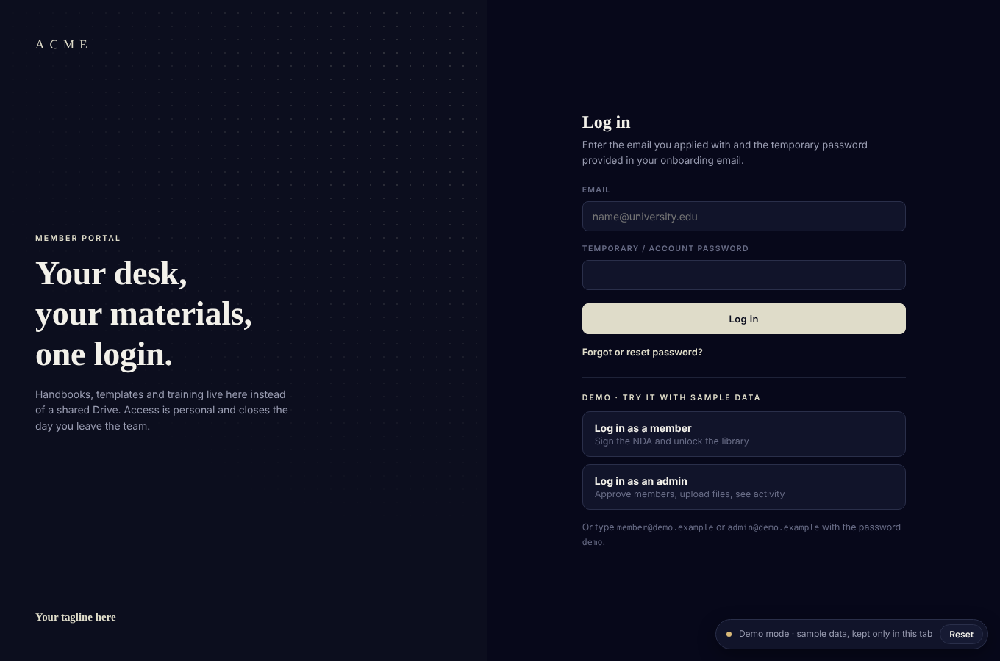
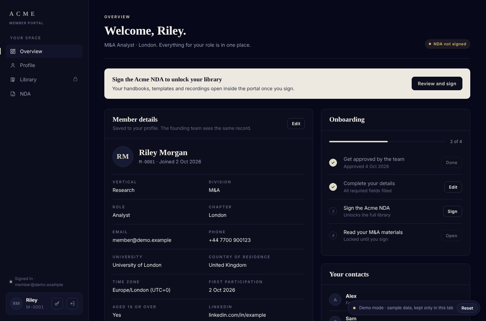
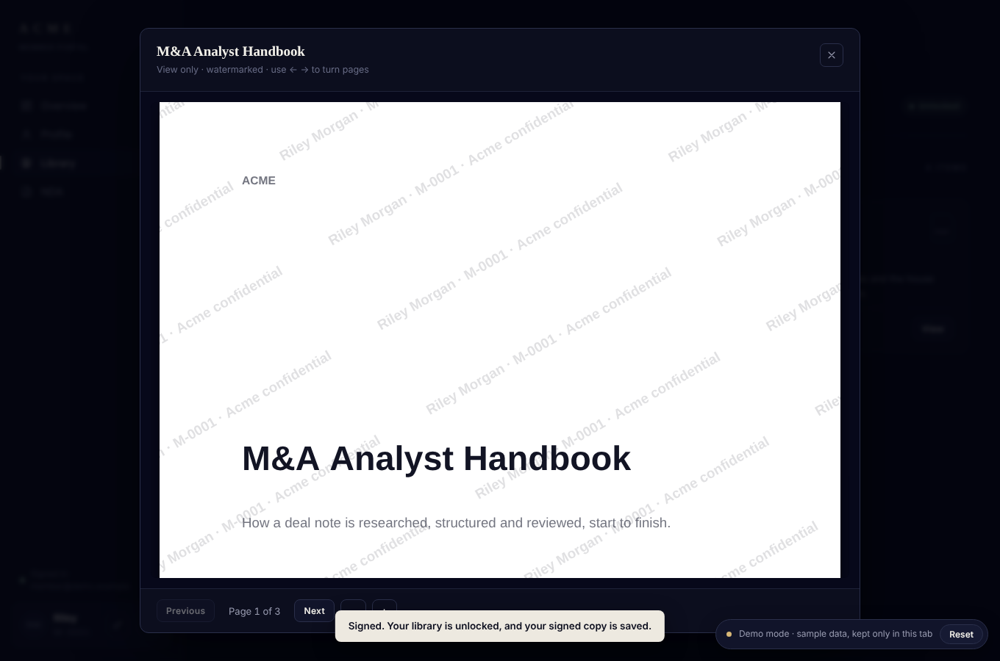
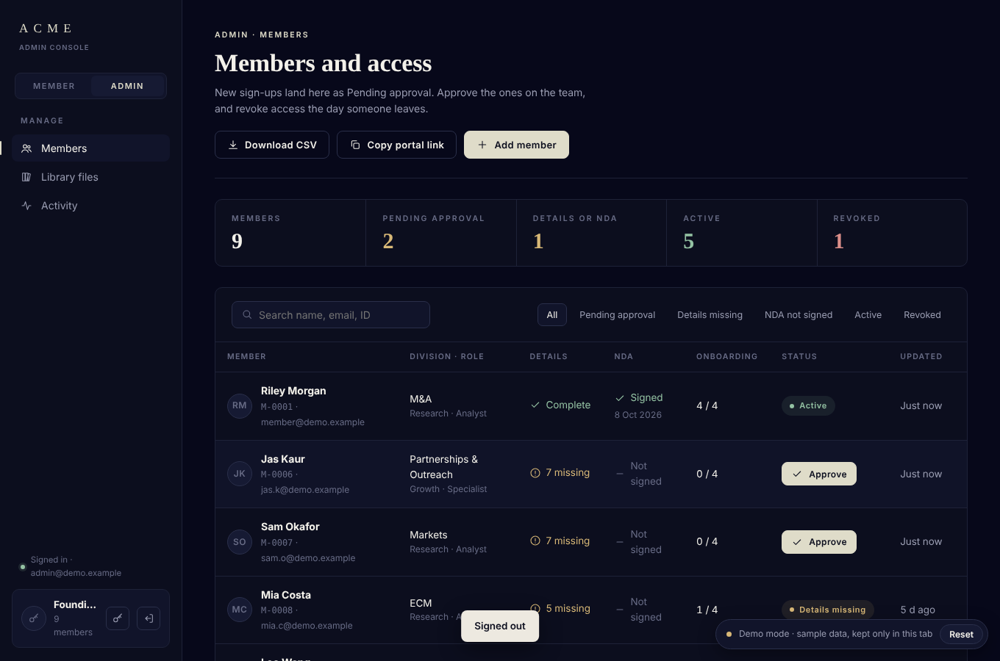

# Member Portal

A gated member portal for a student-run organisation: sign-up, admin approval, an e-signed NDA, and a document library that only unlocks once a member is approved and has signed.

Built from scratch as a single HTML file. No framework, no build step. Plain HTML, CSS and JavaScript on top of Supabase (Auth, Postgres, Storage, Realtime).

**[Live demo →](https://YOUR-USERNAME.github.io/member-portal/)** · runs on sample data, no sign-up needed. Click **Log in as a member** or **Log in as an admin**.



| Member overview | Protected viewer | Admin console |
|---|---|---|
|  |  |  |

---

## What it does

**For members**
- Log in with email and password, confirm email with a 6-digit code, reset a forgotten password by code
- Forced password change on first login when an admin issued a starting password
- Onboarding checklist with a progress meter: approved → details complete → NDA signed → materials opened
- Profile form with validation (international phone format, no future dates, required fields)
- Read the agreement in a custom reader with a clickable table of contents, a scroll progress bar and active-section tracking
- Sign it on a canvas signature pad (mouse, trackpad or finger). The signed copy is generated as a PDF in the browser and stored privately
- Browse a library filtered to their own division, with view-only and downloadable files

**For admins**
- Member table with search, status filters and live counts (pending, incomplete, active, revoked)
- Approve, revoke, restore or delete members, with inline confirmation for destructive actions
- Change a member's vertical, division and role
- Add members directly and provision their login through a database function
- Upload files with a size limit, set who can see them and whether they can be downloaded, edit or delete them later
- Activity feed of every view and download, plus a per-member history
- Export the member list as CSV

## Technical highlights

| Area | How |
|---|---|
| Access control | Postgres row-level security decides what each user can read and write. The UI only reflects it |
| Private files | Storage buckets are private. Files open through signed URLs that expire after 2 minutes (4 hours for video) |
| Protected viewer | PDFs render page by page to a canvas with PDF.js, stamped with a tiled watermark of the viewer's name and member ID. Right-click, Cmd/Ctrl+S, Cmd/Ctrl+P and printing are blocked |
| E-signature | Pointer-event signature pad with HiDPI scaling. The ink is cropped and recoloured, then pdf-lib stamps it, the member's particulars, the date and an audit line onto the agreement PDF |
| Live updates | Realtime subscriptions on the members and resources tables refresh the UI, with debouncing. Re-renders are deferred while someone is mid-signature or mid-edit so nothing is lost |
| Rendering | A small state object and template-string views. Focus, cursor position and in-progress form values survive re-renders |
| Errors | Raw Supabase errors are mapped to plain-language messages |
| Layout | Sidebar collapses to a top bar under 820px, safe-area insets for iOS, `prefers-reduced-motion` respected, visible focus states and ARIA labels throughout |
| Libraries | Loaded on demand only when needed (PDF.js for the viewer, pdf-lib for signing) |

## Stack

- HTML, CSS (custom properties, grid), vanilla JavaScript
- [Supabase](https://supabase.com): Auth, Postgres + RLS, Storage, Realtime
- [PDF.js](https://mozilla.github.io/pdf.js/) for rendering, [pdf-lib](https://pdf-lib.js.org/) for writing PDFs

## Demo mode

When no Supabase keys are set, the portal runs in demo mode. A stand-in for the Supabase client keeps sample members, files and activity in the browser tab (`sessionStorage`), so the site works on GitHub Pages with no backend. It applies the same rules as the real database: members only see their own record, can't approve themselves, can't sign before approval, and files stay locked until they sign. The sample handbooks are generated as PDFs in the browser.

Try the full journey:
- **As a member:** sign the NDA, then open a watermarked handbook and download the template.
- **As an admin:** approve a pending member, add a new one (then log in as them with the starting password and you'll be asked to change it), upload a file and check the activity log.
- **Reset** (bottom right) restores the sample data.

## Publish the demo on GitHub Pages

1. Push this folder to a public GitHub repository.
2. In the repo, go to **Settings → Pages**, set the source to **Deploy from a branch**, branch `main`, folder `/ (root)`, and save.
3. After a minute the site is live at `https://YOUR-USERNAME.github.io/REPO-NAME/`. Put that link at the top of this README.

## Run it with a real backend

1. Create a Supabase project.
2. Create two **private** storage buckets: `library` and `agreements`.
3. Run `supabase/schema.sql` in the SQL editor. It creates the tables, row-level security policies, storage rules, triggers and the `is_admin`, `claim_member` and `admin_create_login` functions.
4. In `index.html`, set `SUPABASE_URL` and `SUPABASE_KEY` (the publishable/anon key, never the service-role key). Demo mode switches off automatically.
5. Serve the folder with any static host (GitHub Pages, Netlify, Vercel), or locally with `npx serve`.
6. Create your login (Supabase dashboard → Authentication → Add user), then make yourself an admin with the query at the bottom of `schema.sql`.
7. Rebrand: find and replace `Acme`, set your own divisions, roles and contacts near the top of the script, and swap the sample agreement in `NDA_HTML` for your own. Change the starting password in both `index.html` and `admin_create_login`.

### Project structure

```
index.html            the whole app: markup, styles and script
supabase/schema.sql   tables, RLS policies, triggers and functions
docs/                 screenshots used in this README
```

## Notes and limits

- Watermarking and blocked shortcuts deter casual copying. They can't stop a screenshot or a determined user. The real protection is RLS plus short-lived signed URLs.
- Rules that matter are enforced in the database: members can't approve themselves, change their role, sign before approval or re-sign. Triggers in `schema.sql` handle this.
- `admin_create_login` writes to Supabase's auth tables directly. It works, but it isn't an official API.
- The agreement is sample text, not legal advice. Organisation details are placeholders; the original was built for a real organisation and its content is not included.

## Author

**[Your name]** · [LinkedIn](https://linkedin.com/in/your-handle) · [Email](mailto:you@example.com)
